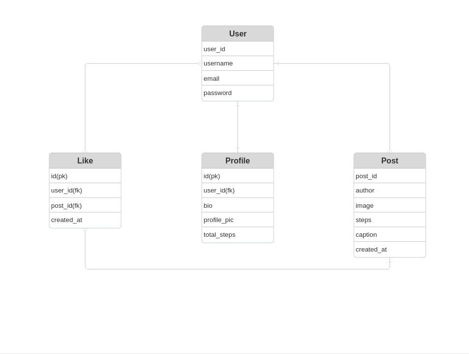

# Today I Walked - Backend

## Project Description
The back-end of Today I Walked is built with Django and Django REST Framework. It provides APIs for users to create accounts, post their daily walks, track their steps and like posts.

## Repo Description
This repository contains the back-end code for the Today I Walked project.

## Tech Stack
* Python
* Django
* Django REST Framework
* PostgreSQL

## Front End Repo Link
[Front-end Repo](https://git.generalassemb.ly/Khaled-Alotibi/Today-i-walked-frontend)

## ERD Diagram

## Routing Table
| Endpoint | Method | Description |
|----------|--------|-------------|
| /api/profiles/ | GET, POST | Get all profiles or create a new profile |
| /api/profile/<user_id> | GET, PATCH, DELETE | Get, update, or delete a specific profile |
| /api/posts/ | GET, POST | Get all posts or create a new post |
| /api/posts/<post_id>/ | GET, PATCH, DELETE | Get, update, or delete a specific post |
| /api/posts/<user_id>/posts/ | GET | Get all posts by a specific user |
| /api/posts/<post_id>/like/ | POST, DELETE | Like or unlike a post |
| /api/login/ | POST | User login |
| /token/refresh/ | POST | Refresh JWT token |
| /api/signup/ | POST | signup a new user |

## Installation Instructions
### With Docker
1. Clone this repo:
`git clone https://git.generalassemb.ly/Khaled-Alotibi/Today-i-walked-backend`
2. Build the Docker image
`docker build -t today-i-walked-backend .`
3. Run the container
`docker run -p 8000:8000 --env-file ./.env today-i-walked-backend`

## IceBox Features
* Follow / Unfollow functionality
* Add more analytics (daily steps, achievements)
* Improve security and auth
